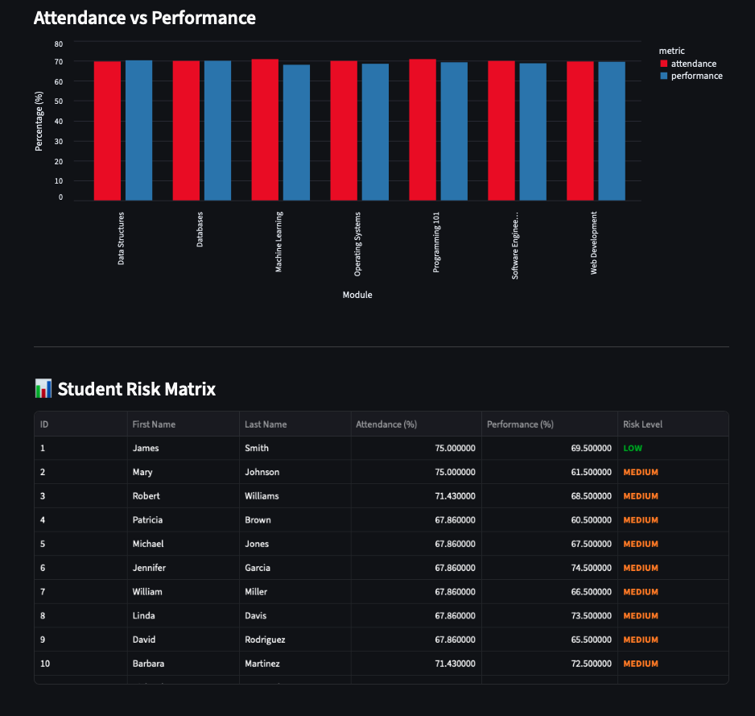

# UniSystem — University Student Data Platform

A full-stack student data management system built with FastAPI and Streamlit. Designed for university staff to monitor student performance, attendance, and wellbeing through role-based dashboards backed by a RESTful API.

---

## What it does

UniSystem gives three staff roles access to purpose-built dashboards:

| Role | Access |
|------|--------|
| **Course Director** | Attendance vs performance analytics, grade distribution, per-student risk matrix |
| **Wellbeing Officer** | Student wellbeing records, RAG risk scoring, CSV bulk import |
| **Admin** | Full CRUD management of students, courses, and modules |

The backend exposes a FastAPI REST API consumed by the Streamlit frontend. All data is stored in a SQLite database that can be seeded with realistic sample data (100 students, 8 courses, 25 modules, 3 000+ wellbeing records) in one command.

---

## Tech stack

| Layer | Technology |
|-------|-----------|
| API | FastAPI, Uvicorn |
| ORM | SQLAlchemy |
| Database | SQLite (PostgreSQL-ready) |
| Validation | Pydantic |
| Frontend | Streamlit |
| Charts | Altair |
| Testing | pytest |
| Language | Python 3.10+ |

---

## Architecture

The backend follows **Clean Architecture** with four explicit layers:

```
Domain Layer          — pure Python entities (Student, Course, Module, …)
Data Access Layer     — SQLAlchemy ORM tables + repository pattern
Business Logic Layer  — services (analytics, risk scoring, CRUD)
Presentation Layer    — FastAPI routers + Pydantic DTOs
```

---



## Getting started

### 1. Clone and create a virtual environment

```bash
git clone <repo-url>
cd Student-data-system
python3 -m venv .venv
source .venv/bin/activate      # Windows: .venv\Scripts\activate
```

### 2. Install dependencies

```bash
# Backend
pip install fastapi uvicorn sqlalchemy pydantic

# Frontend
pip install -r frontend/requirements.txt
```

### 3. Seed the database

```bash
python src/seed_university_db.py          # create and populate university.db
python src/seed_university_db.py --reset  # drop, recreate, and reseed
```

### 4. Start the backend

```bash
uvicorn main:app --reload --host 127.0.0.1 --port 8000
```

Interactive API docs: [http://127.0.0.1:8000/docs](http://127.0.0.1:8000/docs)

### 5. Start the frontend

```bash
# Option A — from frontend/src directory
cd frontend/src
streamlit run app.py

# Option B — from repo root
PYTHONPATH=frontend/src streamlit run frontend/src/app.py
```

Streamlit UI: [http://localhost:8501](http://localhost:8501)

### Demo credentials

| Role | Username | Password |
|------|----------|----------|
| Admin | `admin@university.edu` | `adminpass` |
| Director | `director@university.edu` | `directorpass` |
| Wellbeing | `health@university.edu` | `pass123` |

---

## Key features

**Director Dashboard**
- Aggregate attendance and performance metrics per course and module
- Altair bar charts comparing modules side-by-side
- Grade distribution histogram
- Student risk matrix: each student flagged HIGH / MEDIUM / LOW based on attendance and grade thresholds

**Wellbeing Dashboard**
- Full wellbeing record table (stress, sleep, activity, food quality, alcohol/drug use, medication)
- RAG (Red/Amber/Green) risk scoring computed from composite wellbeing indicators
- Average stress level chart per course
- CSV bulk upload with per-row validation and progress feedback

**Data Management**
- Search, create, update, and delete records for Students, Courses, and Modules
- Foreign key dropdowns, field validation, and confirmation guards on destructive operations
- Auto-refreshing tables after mutations

---

## Running the tests

```bash
pytest tests/
```

The test suite covers entity construction, repository operations, and ORM table constraints using an in-memory SQLite database.

---

## Project structure

```
Student-data-system/
├── main.py                          # FastAPI application entry point
├── university.db                    # SQLite database (generated by seeder)
├── frontend/
│   ├── requirements.txt
│   ├── wellbeing_sample.csv         # Sample CSV for wellbeing bulk import
│   ├── DATA_MANAGEMENT_STRUCTURE.md # Frontend module architecture notes
│   └── src/
│       ├── app.py                   # Streamlit entry point
│       ├── utils.py
│       ├── components/
│       │   └── layout.py
│       ├── data/
│       │   └── dashboard_api.py     # HTTP client for backend API
│       └── pages/
│           ├── login.py
│           ├── director.py
│           ├── wellbeing.py
│           ├── data_management.py
│           └── tables/              # Per-table CRUD modules
│               ├── student_table.py
│               ├── course_table.py
│               └── module_table.py
├── src/
│   ├── seed_university_db.py        # Database seeder
│   ├── DBgenerating.py              # Schema creation utility
│   ├── Domain_Layer/
│   │   ├── Entities/                # Pure Python domain models
│   │   └── I_Repositories/         # Repository interfaces
│   ├── Data_Access_Layer/
│   │   ├── DB.py                    # SQLAlchemy engine + session
│   │   ├── Base.py
│   │   ├── Tables/                  # SQLAlchemy ORM table definitions
│   │   └── Repositories/           # Concrete repository implementations
│   ├── Business_Logic_layer/
│   │   └── Services/               # Analytics, CRUD, and risk services
│   ├── Presentation_Layer/
│   │   ├── DTOs/                   # Pydantic request/response models
│   │   └── Routers/                # FastAPI route handlers
│   └── Exceptions/                 # Domain exception classes
├── tests/
│   ├── test_entities/              # Domain entity unit tests
│   ├── test_repositories/          # Repository integration tests
│   └── test_tables/               # ORM table constraint tests
├── docs/
│   ├── Diagrams.pdf                # Architecture and ER diagrams
│   └── Project Documentation.xlsx
└── .gitignore
```

---

## Troubleshooting

| Problem | Fix |
|---------|-----|
| Import errors in Streamlit | Run from `frontend/src` or set `PYTHONPATH=frontend/src` |
| `university.db` not found | Run `python src/seed_university_db.py` first |
| Port conflict | Change port with `--port 8001` (backend) or `--server.port 8502` (frontend) |
| Backend unreachable from frontend | Ensure both terminals have the venv activated and backend is running on port 8000 |

---

## Contributors

| Name | GitHub |
|------|--------|
| Ubay AlShamali | [@BOBMSH](https://github.com/BOBMSH) |
| Dilara Bayram | [@dilaraBy](https://github.com/dilaraBy) |
| Dawood Butt | [@dawoodahmedbutt](https://github.com/dawoodahmedbutt) |
| Ibrahim ElHaj | [@IbrahimHaj14](https://github.com/IbrahimHaj14) |
| Zeyad Khalil | [@Ziro21](https://github.com/Ziro21) |
| Momay Kitrueangphatchara | [@Natchareek](https://github.com/Natchareek) |
| Utkarsh Pandey | [@utkarsh-p7](https://github.com/utkarsh-p7) |
| Mimi Phan | [@ptthao0801](https://github.com/ptthao0801) |
| Cliff Yao | [@cliffyao10](https://github.com/cliffyao10) |

---

## Notes

- SQLite is used by default for convenience. For production, update `DATABASE_URL` in `src/Data_Access_Layer/DB.py` to a PostgreSQL or MySQL connection string.
- Passwords in the seed data are stored in plain text for demo purposes only. Production deployments should use proper password hashing (e.g. bcrypt via `passlib`).
